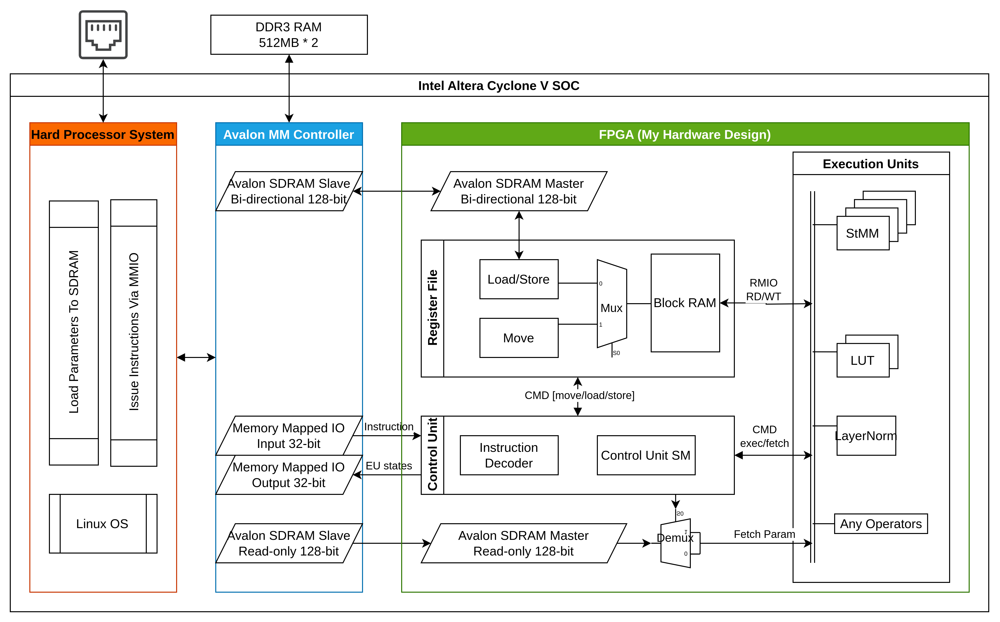

# ELEC4848 Senior Design Project

An FPGA-based reconfigurable neural processing unit



_Full document to be uploaded._


## Project Overview
| Directory | Content | 
| --- | --- |
| [design_rtl](design_rtl/) | RTL design in SystemVerilog language |
| [ip_cores](ip_cores/) | IP cores generated in Quartus Prime Lite for both verification and implementation | 
| [simulation](simulation/) | Testbenches, simulation programs, and scripts to compile and elaborate simulation |
| [quartus_proj](quartus_proj/) | Archived quartus project |
| [test_data](test_data/) | Binary test data for functional simulation |

## Verify in ModelSim
1. Enter ModelSim either in GUI or CLI mode 
    ```
    $ vsim -c
    ```

2. Change to project root directory
    ```
    Questa> pwd
    # /home/eric/Documents/Conformer-FPGA-New/TinyNPU
    ```

3. Compile
    ```
    Questa> do simulation/testbench/compile.tcl 
    ```

4. Elaborate
    ```
    Questa> do simulation/testbench/elaborate.tcl 
    ```

5. Run simulation
    ```
    VSIM 9> run -a
    ```

6. Check output

    Output is then written back to memory file 
as defined by the parameter `WT_MEM_FILE` in `soc_system_bfm` module.

    You may check the mem file using hex editor or using python as 
    ```
    output = np.fromfile("wt_mem.bin", dtype="int8")[0x10_000:]
    ``` 

## Compile in Quartus
1. Open the [quartus_proj/tiny_npu.qpf](quartus_proj/tiny_npu.qpf) project file in Quartus
2. Follow instructions to upgrade IPs and re-generate codes
3. Click `Compile Design`

If fitting fails due to routing congestion, 
please make sure `Fitting Aggressive Routability Optimizations` is set to `Always`.

## Deploy on board 
Follow the manuals from Intel, Terasic, or [this](https://github.com/zangman/de10-nano).

## Write HPS program to utilize this design
See [https://github.com/EricEricEricJin/TinyNPU_hps_program](https://github.com/EricEricEricJin/TinyNPU_hps_program).